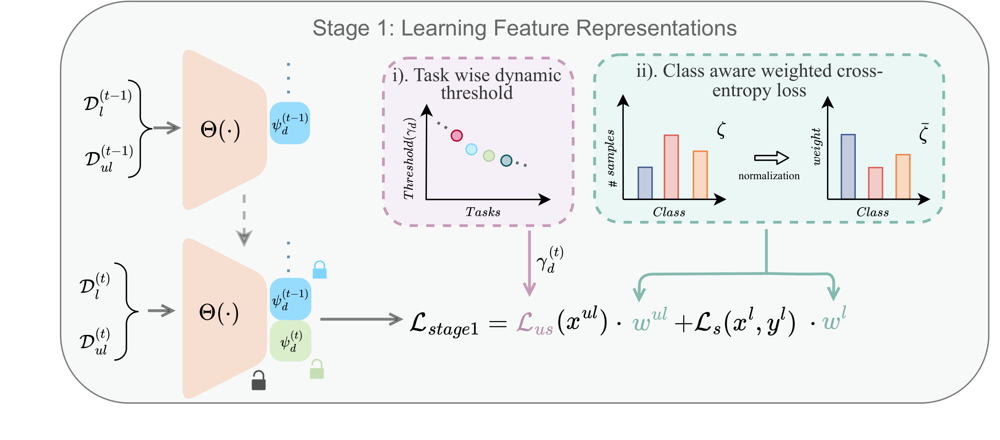
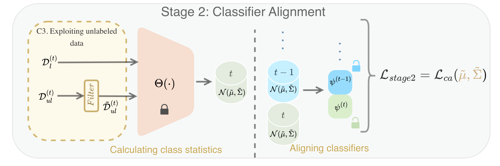
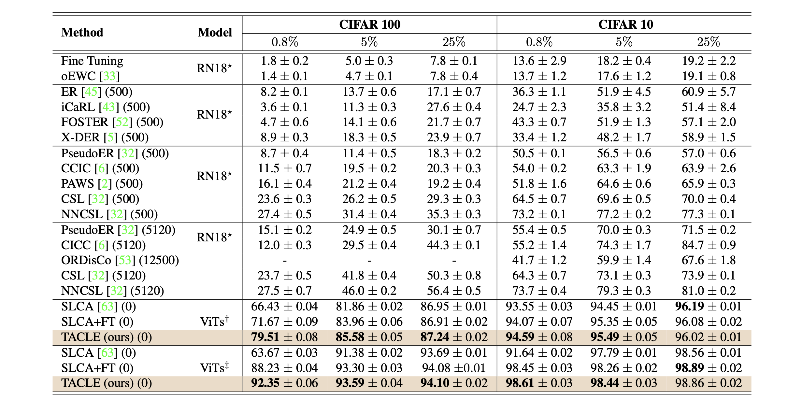
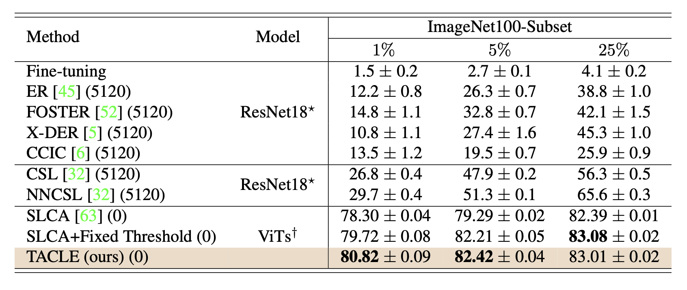
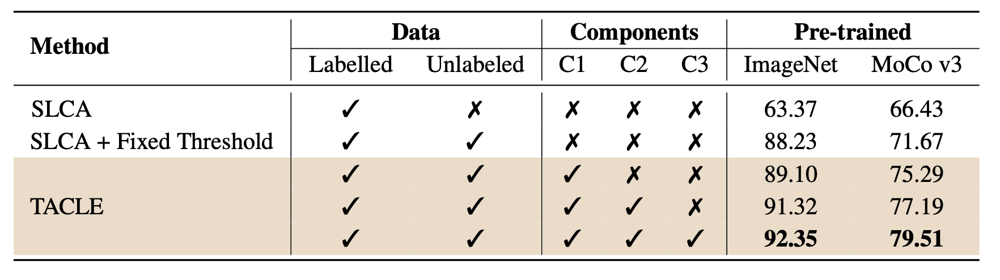

# TACLE: Task and Class-aware Exemplar-free Semi-supervised Class Incremental Learning

[](https://arxiv.org/pdf/2407.08041)
[](https://rokmr.github.io/tacle)
[](assets/wacv25-0789.pdf)

Official implementation of the paper: [TACLE: Task and Class-aware Exemplar-free Semi-supervised Class Incremental Learning](https://arxiv.org/pdf/2407.08041)

## Overview

TACLE addresses the challenging problem of exemplar-free semi-supervised class incremental learning. At each new task, the model learns new classes from both labeled and unlabeled data without storing examples from previous classes. Key features include:

- Task-adaptive threshold to maximize unlabeled data utilization
- Class-aware weighted cross-entropy loss for handling under-represented classes
- Unlabeled data exploitation for classifier alignment
- Effective performance on CIFAR10, CIFAR100, and ImageNet-Subset100 benchmarks


*Comparison between Class Incremental Learning (CIL), Semi-Supervised CIL (SS-CIL), and Exemplar-Free Semi-Supervised CIL (EFSS-CIL) settings.*

## Method

TACLE employs a two-stage training approach:

### Stage 1: Initial Training

*Training on labeled and high-confidence unlabeled data using class-aware weighted cross-entropy loss. The model learns from both labeled samples and carefully selected unlabeled samples that exceed a task-adaptive confidence threshold.*

### Stage 2: Fine-tuning

*Fine-tuning on unlabeled data using task-adaptive thresholding. This stage further refines the model's performance by leveraging unlabeled data for classifier alignment.*

Key Components:
- Task-adaptive thresholding for unlabeled data selection
- Class-aware weighted cross-entropy loss to handle class imbalance
- Classifier alignment using unlabeled data
- No storage of exemplars from previous tasks

## Installation

1. Clone the repository:
```bash
git clone https://github.com/rokmr/TACLE.git
cd TACLE
```

2. Create and activate the conda environment:
```bash
conda env create -f environment.yml
conda activate tacle
```

3. Install PyTorch and other dependencies:
```bash
conda install pytorch==1.12.1 torchvision==0.13.1 cudatoolkit=11.6 -c pytorch -c conda-forge
pip install timm==0.5.4
pip install quadprog
pip install POT
```

## Usage

### Training Example

To train TACLE on CIFAR-10 with 0.8% labeled data:
```bash
python main.py --config=./configs/cifar10/tacle_cifar10-imagenet_pretrained_0.8%.json
```

## Results

Our method achieves state-of-the-art performance across multiple benchmarks:

### CIFAR Results

*Average incremental accuracy on CIFAR10 (after 5 tasks) and CIFAR100 (after 10 tasks) for SS-CIL. Numbers in brackets indicate exemplar count (our approach uses none). Notations: ★: trained from scratch, †: MoCo v3 pretrained, ‡: ImageNet pretrained, RN18: ResNet18, FT: fixed threshold (FixMatch).*

### ImageNet-100 Results

*Comparison of average incremental accuracy on ImageNet-Subset100 after 20 tasks. Numbers in brackets show buffer size. ★: models trained from scratch, †: MoCo v3 pretrained.*

### Ablation Study

*Ablation study on CIFAR100 with 0.8% labeled data, showing average incremental accuracy after 10 tasks. Components: C1: task-wise dynamic threshold, C2: class-aware CE loss, C3: unlabeled data exploitation in stage 2.*

Key Findings:
- Outperforms existing methods without requiring exemplar storage
- Effective with both ImageNet and MoCo v3 pretrained models
- Robust performance even with imbalanced unlabeled data
- Works well in extreme cases (one labeled example per class)

For detailed experimental results and comparisons, please refer to our [paper](https://arxiv.org/pdf/2407.08041).

## Citation

If you find this work useful in your research, please consider citing:

```bibtex
@article{kalla2024tacle,
  title={TACLE: Task and Class-aware Exemplar-free Semi-supervised Class Incremental Learning},
  author={Kalla, Jayateja and Kumar, Rohit and Biswas, Soma},
  journal={arXiv preprint arXiv:2407.08041},
  year={2024}
}
```

## Acknowledgments

This work is partly supported through a research grant from SERB, Department of Science and Technology, Govt. of India (SPF/2021/000118).

## License

This project is licensed under the MIT License - see the LICENSE file for details.