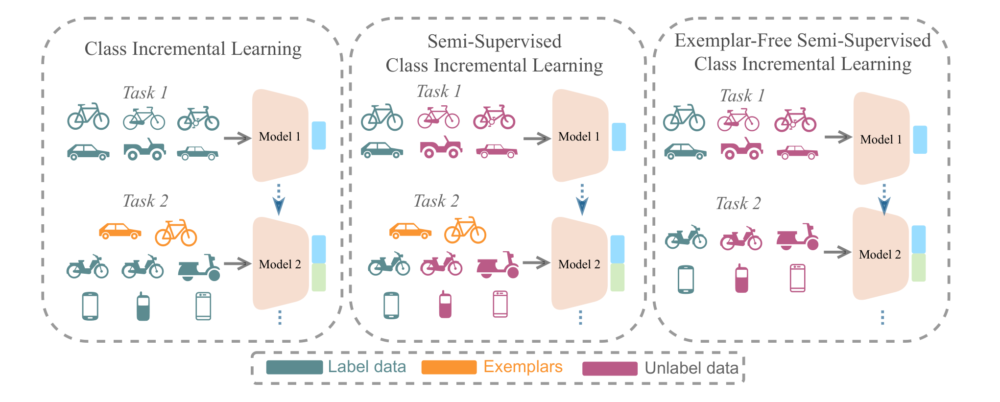

# TACLE
[](https://arxiv.org/pdf/2407.08041)
[](https://rokmr.github.io/tacle)

Official Repository of the paper: [TACLE: Task and Class-aware Exemplar-free Semi-supervised Class Incremental Learning](https://arxiv.org/pdf/2407.08041)


# Local installation

Cloning the GitHub repo and moving to the correct directory.

```bash
cd $HOME && git clone https://github.com/rokmr/TACLE.git
cd $HOME/TACLE
```

Setting up the environment for TACLE
```
conda env create -f environment.yml
conda activate tacle
conda install pytorch==1.12.1 torchvision==0.13.1 cudatoolkit=11.6 -c pytorch -c conda-forge
pip install timm==0.5.4
pip install quadprog
pip install POT
```

# Coming Soon

We are actively working on releasing the complete codebase for TACLE. The code will be made publicly available here soon. In the meantime, if you have any questions, please feel free to open an issue or reach out to the authors.

We appreciate your interest and patience as we prepare the code release. Stay tuned for updates!


# Introduction



*Difference between Class Incremental Learning (CIL), Semi-Supervised CIL (SS-CIL), and Exemplar-Free Semi-Supervised CIL (EFSS-CIL) settings.*


# Citation
```bash 
@article{kalla2024tacle,
  title={TACLE: Task and Class-aware Exemplar-free Semi-supervised Class Incremental Learning},
  author={Kalla, Jayateja and Kumar, Rohit and Biswas, Soma},
  journal={arXiv preprint arXiv:2407.08041},
  year={2024}
}

```
# Acknowledgments
This work is partly supported through a research grant from SERB, Department of Science and Technology, Govt. of India (SPF/2021/000118).